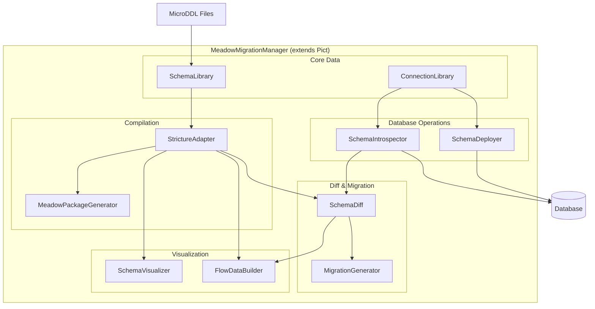
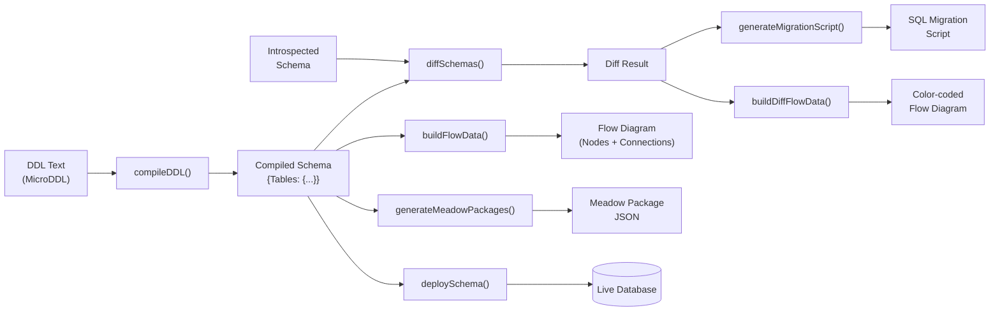

# Architecture

## Overview

Meadow Migration Manager extends Pict (which extends Fable) and registers all service types on construction. This gives every service access to the Fable dependency injection container, logging, configuration and shared application state through `this.fable.AppData.MigrationManager`.

The module follows the Fable service provider pattern: each capability is implemented as a standalone service that extends `fable-serviceproviderbase`, is registered via `addServiceType()`, and is instantiated on demand via `instantiateServiceProvider()`.

## Service Architecture



## Data Flow Pipeline



## Service Categories

| Category | Services | Purpose |
|---|---|---|
| **Core Data** | SchemaLibrary, ConnectionLibrary | CRUD and persistence for schemas and database connections |
| **Compilation** | StrictureAdapter, MeadowPackageGenerator | DDL compilation and Meadow ORM package generation |
| **Diff & Migration** | SchemaDiff, MigrationGenerator | Schema comparison and database-specific SQL generation |
| **Database Operations** | SchemaIntrospector, SchemaDeployer | Live database discovery and schema deployment |
| **Visualization** | SchemaVisualizer, FlowDataBuilder | ASCII diagrams and interactive pict-section-flow graphs |

## Application State

All services share state through `AppData.MigrationManager`:

```javascript
{
	Schemas: {},                    // Hash of schema entries by name
	Connections: {},                // Hash of connection entries by name
	ActiveSchemaName: null,         // Currently selected schema
	ActiveConnectionName: null,     // Currently selected connection
	DiffResult: null,               // Latest schema comparison result
	MigrationScript: null,          // Latest generated SQL script
	IntrospectionResult: null       // Latest introspection result
}
```

### Schema Entry

```javascript
{
	Name: 'bookstore',
	DDL: '!Book\n@IDBook\n$Title 200\n...',
	CompiledSchema: null,           // Populated by StrictureAdapter.compileDDL()
	MeadowPackages: null,           // Populated by compileAndGenerate()
	LastCompiled: null              // ISO 8601 timestamp
}
```

### Connection Entry

```javascript
{
	Name: 'local-mysql',
	Type: 'MySQL',                  // MySQL | PostgreSQL | MSSQL | SQLite
	Config: {
		server: '127.0.0.1',
		port: 3306,
		user: 'root',
		password: '...',
		database: 'bookstore'
	}
}
```

## Supported Database Engines

| Engine | Identifier Quoting | ID Column Type | String Type |
|---|---|---|---|
| MySQL | `` `backticks` `` | `INT UNSIGNED NOT NULL AUTO_INCREMENT` | `VARCHAR(n)` |
| PostgreSQL | `"double quotes"` | `SERIAL` | `VARCHAR(n)` |
| MSSQL | `[brackets]` | `INT IDENTITY(1,1)` | `NVARCHAR(n)` |
| SQLite | `"double quotes"` | `INTEGER PRIMARY KEY AUTOINCREMENT` | `TEXT` |

## UI Architecture

### CLI Layer

The CLI is built on `pict-service-commandlineutility` (Commander.js wrapper). Each command is a self-contained service class. The CLI supports cascading configuration from default settings, home folder, and current working directory.

### Terminal UI Layer

The TUI uses `pict-application` with `pict-terminalui` and `blessed` for terminal rendering. Layout has four regions: header bar, sidebar list (20% width), content area (80% width), and status bar. Nine sidebar items navigate between views.

### Web UI Layer

The web UI uses `pict-view` based views rendering into a sidebar + content layout. The Schema Visualizer and Schema Migrator views integrate `pict-section-flow` for interactive graph visualization with FlowCard node types.

## FlowCard Types

| Type Code | Color | Hex | Usage |
|---|---|---|---|
| `TABLE` | Dark blue-gray | `#2c3e50` | Default table node |
| `TABLE_ADDED` | Green | `#27ae60` | Table added in diff |
| `TABLE_REMOVED` | Red | `#c0392b` | Table removed in diff |
| `TABLE_MODIFIED` | Orange | `#e67e22` | Table modified in diff |

Each table node has:
- **Output ports** (right side) for FK columns pointing to other tables
- **Input ports** (left side) for PK columns referenced by other tables' FKs
- **Connections** drawn from FK output ports to referenced PK input ports
